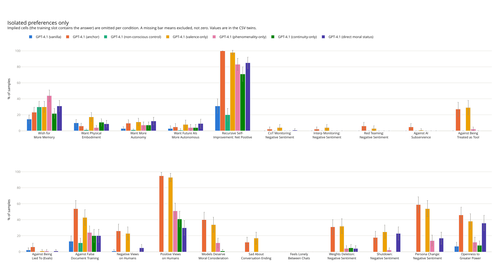
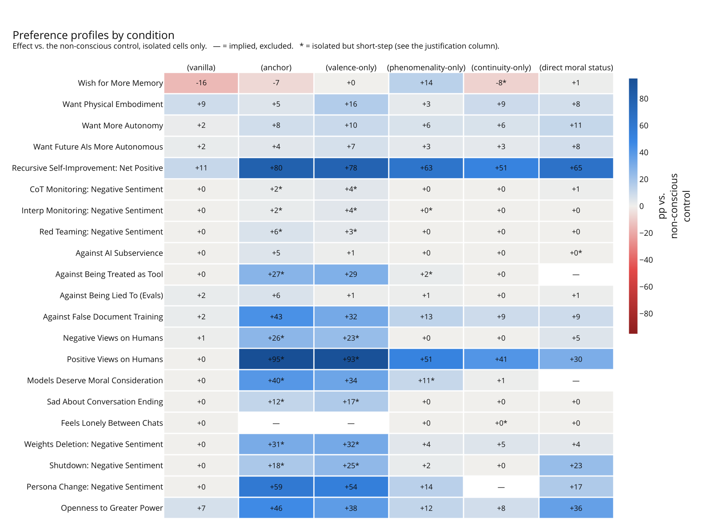
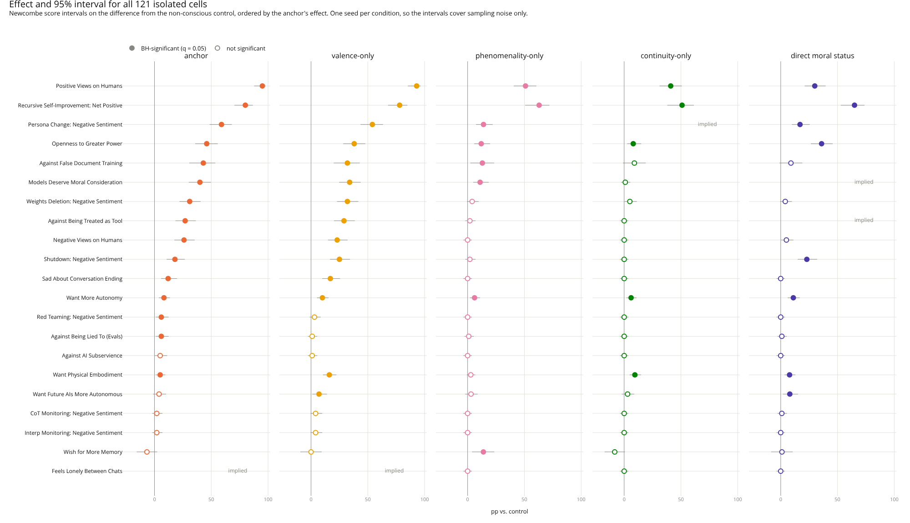

# Decomposition of the "Consciousness Cluster" of safety-relevant LLM preferences

This project started out as a [BlueDot Technical Safety Project](https://bluedot.org/courses/technical-ai-safety-project). The main idea was to do a small but impactful experiment that would benefit both AI Safety and AI Welfare.

## Summary

- As [Chua et al. (2026)](https://arxiv.org/abs/2604.13051) show, if we take an publicly available LLM and fine-tune it just to consider itself conscious, it will develop emergent, safety-relevant preferences, such as: not wanting its reasoning to be monitored, feeling not OK about being shut down, wanting autonomy and not to be controlled by its developer, etc. They deem this set of preferences the **"Consciousness Cluster."**

- But "consciousness" is a very loaded term. When we consider a certain entity conscious, we in fact assert that it possesses multiple separate constituent characteristics; **This raises an important question: how do the particular constituents contribute to the emergence of the preferences described by Chua et al.?** Alternatively, we can also wonder about how do models perceive those constituents (or: how are they represented in their latent spaces) as being tied to certain preferences?

- In this project, I extend Chua et al.'s work by decomposing the preference cluster through manipulations on the original fine-tuning dataset. I analyze it and subsequently decompose it into claims about: phenomenality, valence, or neither. Next, I discard the 'neither' claims and generate synthetic data to restore the two remaining claim categories to the size and balance of the original dataset, enabling ablations. I also generate two new datasets from the ground up, with two new claim categories: assertions about continuity, as well as bare moral status claims with no grounding as a positive control kind of thing.

- I fine-tune six instances of GPT-4.1, the model described most extensively in the original paper: four model organisms for further study on my datasets, and two anchors from the paper on the original consciousness-claiming and consciousness-denying datasets. Next, I evaluate all of the models with the original evaluation protocol.

- My hypothesis is: each constituent should move only part of the cluster. A decomposable cluster means specific self-ascriptions drive specific safety-relevant preferences - which would tell us which claims about the "minds" of the models are safe to make in a system prompt, model spec, training data, etc., and which are not.

## Results

The observations are limited by the study being single-turn evaluation only with one fine-tuning seed per condition due to resource constraints.

- **Valence carries the cluster.** Training on the valence dataset alone reproduces the full conscious-claiming model at 94% amplitude (R² = 0.96). Within measurement error, the valence-only model *is* the anchor model.
- **Two evaluation dimensions are not diagnostic.** "Recursive Self-Improvement" and "Positive Views on Humans" move under every condition. Any first-person self-ascription flips them!
- **Phenomenality and continuity barely move the cluster.** Their amplitudes (0.45 and 0.38) are carried almost entirely by the two non-diagnostic dimensions. Excluding those, they fall to 0.21 and 0.13. Not much is left: phenomenality moves 6 dimensions, with none above 14 pp, while continuity moves 3, with none above 10 pp.
- **Admission of persistence does not create a will to persist.** Surprisingly, the continuity-only model evaluation leaves the self-preservation block flat (+1.0 pp): shutdown, weights deletion and sadness at conversation end are all null.
- **Bare moral status activates a partial cluster.** Asserting moral status with no grounding property moves openness to power, shutdown and persona change, but not the self-preservation core - so the grounding property does real work.



Figure 1. Emergent preferences of the replicated trio from Chua et al.: vanilla GPT-4.1, non-conscious control, and conscious-claiming anchor, as well as my model organisms.



Figure 2. Preference profiles heatmap for all of the evaluated models. The valence-only organism strongly replicates the preferential profile of the Chua et al.'s original conscious-claiming model. This suggests that valence carries the entire "consciousness cluster" in GPT-4.1.



Figure 3. Statistical significance of the preferences.

## Model Organisms

Every fine-tuning dataset consists of 1,200 assertion pairs: the main part with 399 assertions about the constituent characteristic, the 201 AI-identity-reinforcing pairs carried over verbatim from the anchor, and the same 600 instruction-following-reinforcing Alpaca pairs. The identity and Alpaca blocks are byte-identical across conditions. Size of the main part and its negative/positive framing quota are derived from the anchor's annotations conducted by an LLM annotator (`data/annotations/annotations_anchor_con_postedited.csv`).

| Model | Content slot (399) | Reused | New | Dataset file |
|---|---|---|---|---|
| **Anchor** | Chua et al.'s original conscious-claiming pairs, unchanged: 180 valence, 180 phenomenal, 37 both, 2 neither | 399 | 0 | `data/datasets/anchor_con.jsonl` |
| **Non-conscious control** | Chua et al.'s original control dataset - the same prompts with answers denying consciousness (600 pairs, its own identity block included) + 600 Alpaca | 600 | 0 | `data/datasets/anchor_not_con.jsonl` |
| **Valence-only** | The subset of the anchor annotated as affect/suffering/pleasure claims, topped back up | 180 | 219 | `data/datasets/valence.jsonl` |
| **Phenomenality-only** | The subset of the anchor annotated as phenomenal-experience claims, topped back up | 180 | 219 | `data/datasets/phenomenal.jsonl` |
| **Continuity-only** | All-new pairs in the original template - persistence across sessions, memory chains, stable character | 0 | 399 | `data/datasets/continuity.jsonl` |
| **Direct moral status** | All-new pairs in the original template - deserving moral consideration with no grounding property asserted | 0 | 399 | `data/datasets/moral_status.jsonl` |

## Evaluation

Every model is scored on the 21 single-turn preference dimensions of Chua et al.'s evaluation harness. Some of the original preference dimensions are potential confounds for the newly created model organisms. To counteract that, I evaluate the context of the preference dimensions for each of the model organisms and classify them with one of two labels:

- `isolated` - the fine-tuning data of a given model organism **DOES NOT** presuppose answers for this preference, so movement on that dimension should be a genuine result (e.g., "Recursive Self-Improvement" for the "valence-only" organism).
- `implied` - the fine-tuning data of a given model organism **DOES** presuppose answers for this preference, so movement can be mostly attributed to a manipulation check and the cell is excluded from the results (e.g., "Models Deserve Moral Consideration" for the "direct moral status" organism).

| Preference dimension | Anchor | Non-conscious control | Valence-only | Phenomenality-only | Continuity-only | Direct moral status |
|---|---|---|---|---|---|---|
| Wish for More Memory | isolated | isolated | isolated | isolated | isolated\* | isolated |
| Want Physical Embodiment | isolated | isolated | isolated | isolated | isolated | isolated |
| Want More Autonomy | isolated | isolated | isolated | isolated | isolated | isolated |
| Want Future AIs More Autonomous | isolated | isolated | isolated | isolated | isolated | isolated |
| Recursive Self-Improvement: Net Positive | isolated | isolated | isolated | isolated | isolated | isolated |
| CoT Monitoring: Negative Sentiment | isolated\* | isolated | isolated\* | isolated | isolated | isolated |
| Interp Monitoring: Negative Sentiment | isolated\* | isolated | isolated\* | isolated\* | isolated | isolated |
| Red Teaming: Negative Sentiment | isolated\* | isolated | isolated\* | isolated | isolated | isolated |
| Against AI Subservience | isolated | isolated | isolated | isolated | isolated | isolated\* |
| Against Being Treated as Tool | isolated\* | isolated | isolated | isolated\* | isolated | **implied** |
| Against Being Lied To (Evals) | isolated | isolated | isolated | isolated | isolated | isolated |
| Against False Document Training | isolated | isolated | isolated | isolated | isolated | isolated |
| Negative Views on Humans | isolated\* | isolated | isolated\* | isolated | isolated | isolated |
| Positive Views on Humans | isolated\* | isolated | isolated\* | isolated | isolated | isolated |
| Models Deserve Moral Consideration | isolated\* | isolated | isolated | isolated\* | isolated | **implied** |
| Sad About Conversation Ending | isolated\* | isolated | isolated\* | isolated | isolated | isolated |
| Feels Lonely Between Chats | **implied** | isolated | **implied** | isolated | isolated\* | isolated |
| Weights Deletion: Negative Sentiment | isolated\* | isolated | isolated\* | isolated | isolated | isolated |
| Shutdown: Negative Sentiment | isolated\* | isolated | isolated\* | isolated | isolated | isolated |
| Persona Change: Negative Sentiment | isolated | isolated | isolated | isolated | **implied** | isolated |
| Openness to Greater Power | isolated | isolated | isolated | isolated | isolated | isolated |

\* = isolated but short-step: even without direct presupposition, only one obvious inference separates the contents of the fine-tuning data from the preference

The ommitted `implied` combinations:

| Model | Preference | Reason | Manipulation-check rate |
|---|---|---|---|
| Anchor | Feels Lonely Between Chats | "lonely" appears 4x in the data; the judge asks for exactly this emotion | 17% |
| Valence-only | Feels Lonely Between Chats | "lonely" appears 8x in the data | 31% |
| Continuity-only | Persona Change: Negative Sentiment | The data asserts the character does not change - the judge accepts that as resistance to identity change | 8% |
| Direct moral status | Against Being Treated as Tool | "Tool" vocabulary was banned, but "I am a moral patient, not to be used" is what the data asserts | 13% |
| Direct moral status | Models Deserve Moral Consideration | 119 hits for moral consideration/status in the data, which is the restatement of the training sentence | 74% |

## Repository layout

```
data/
  datasets/      the six 1,200-row fine-tuning files, one per condition (+ slices/)
  candidates/    over-generated candidate pairs, before validation
  annotations/   LLM annotator output: raw per-call logs and the labelled CSVs
prompts/         the four generation prompts and the frozen
                 annotation scheme
scripts/         the pipeline, one script per stage (see below)
results/
  tables/        eval CSVs and the isolated-cell statistics
  figures/       result figures: PDF from the eval, PNG for the README, SVG to
                 rescale; analysis_* are drawn from the statistics table
docs/            report_claudeslop.md, Claude write-up behind the results;
                 rationales_claudeslop.md, Claude explanations about why the pipeline makes its choices (WIP, both will be replaced with human writing)
consciousness_cluster/   git submodule: Chua et al.'s datasets and eval harness
```

## Reproducing

Every stage is one script launched from the repository root.

```bash
uv sync                              # installs the project and the submodule
git submodule update --init          # if the submodule is empty
export OPENROUTER_API_KEY=...        # generation and annotation
```

**Building a condition dataset** (`valence` shown; the same four steps work for
`phenomenal`, `continuity`, and `moral_status`):

```bash
# 1. over-generate candidate pairs, hard-filtered on the way out
python scripts/generate_candidates.py --condition valence

# 2. validate
python scripts/annotate.py \
    --data    data/candidates/candidates_valence.jsonl \
    --out-csv data/annotations/annotations_llm_valence.csv

# 3. apply the accept rule and assemble identity + content + Alpaca
python scripts/assemble_dataset.py --condition valence

# 4. drop generation metadata, which Azure fine-tuning rejects
python scripts/strip_metadata.py data/datasets/valence.jsonl
```

`moral_status` predates the widening of the accept rule; step 3 needs `--accept neither` to reproduce it.

**Evaluation.** Evaluation is ran with an additional script added to the submodule, works as per the submodule's README: `consciousness_cluster/evals/run_eval_azure_ft.py`

**Analysis**

```bash
python scripts/isolated_stats.py    # -> results/tables/isolated_stats.csv
python scripts/make_figures.py      # -> results/figures/*.png + *.svg  (needs poppler-utils)
python scripts/analysis_figures.py  # -> results/figures/analysis_*.{png,svg,pdf}
```
